# Gemi

- **Introduce the application:**

  - Gemi is a Flutter app inspired by Gemini. It utilizes the Gemini API to build an AI chatbot. Users can
    have interactive conversations with Gemini, utilize the image-to-text feature, and explore a range of
    AI-driven functionalities.

## Getting Started

To run any Android application built with Flutter you need to configure the enviroments in your machine, you can do this following the the tutorial provided by Google in [Flutter website](https://flutter.dev/docs/get-started/install)

- Flutter SDK
- Android Studio (to download Android SDK)
- Xcode (for iOS develop only)
- Any IDE with Flutter SDK installed (ie. IntelliJ, Android Studio, VSCode etc)
- A little knowledge of Dart and Flutter

## Technologies

- Flutter
- Clean Architecture
- Bloc
- Supabase - backend as service

## Setup

1. Clone the repository
2. Open the project in your preferred IDE (e.g. Android Studio, VS Code)
3. Run `flutter pub get` to install the required dependencies
4. Add .env file and API key.
5. Run the project in an emulator or on a physical device

## Screenshots

  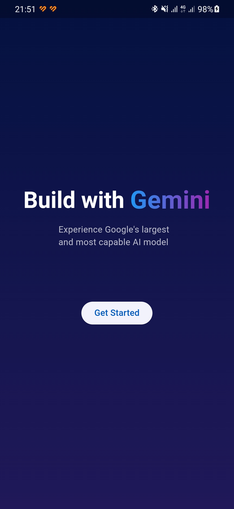
  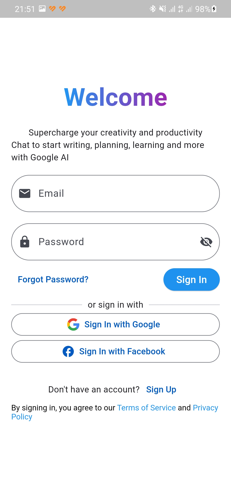
  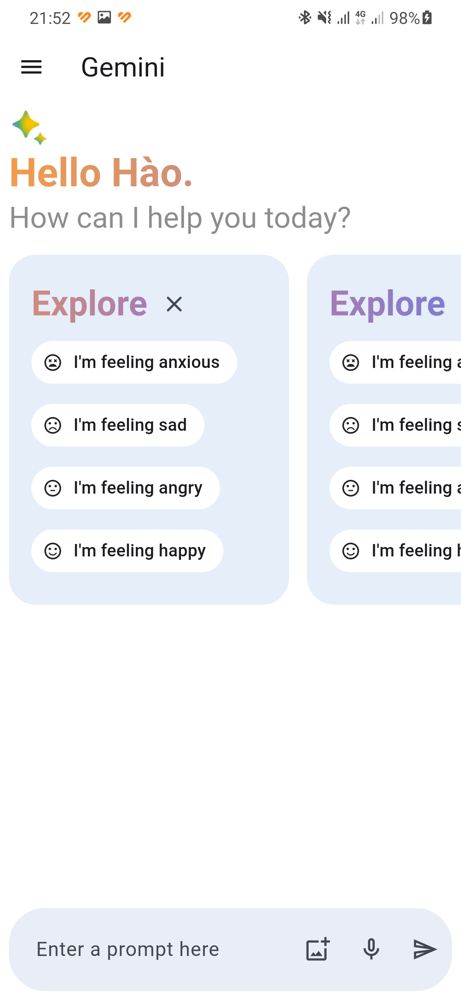
  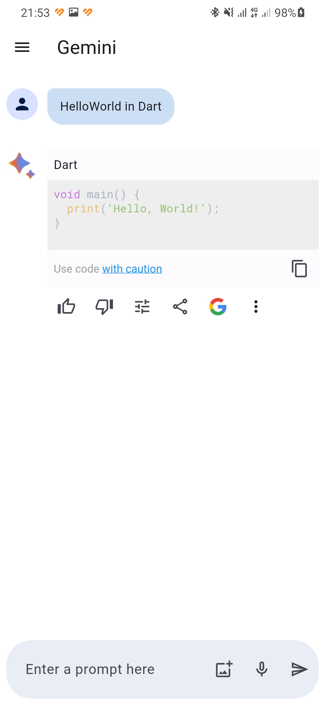
  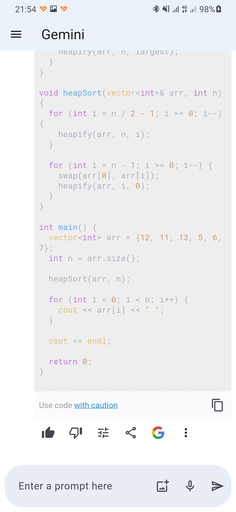

  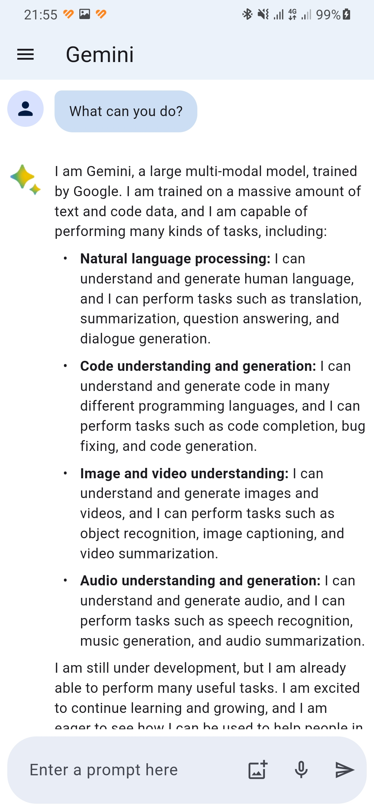
  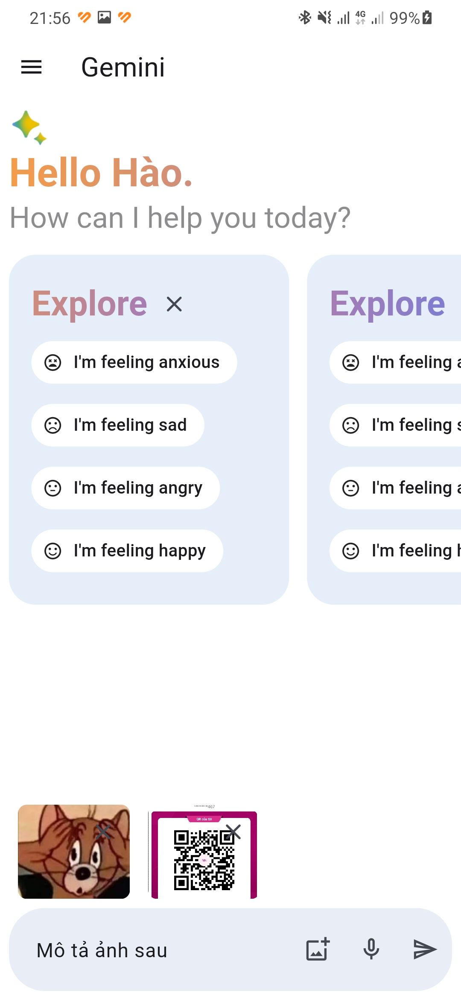
  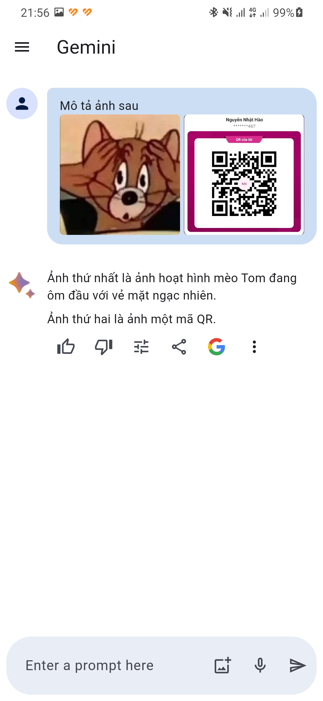
  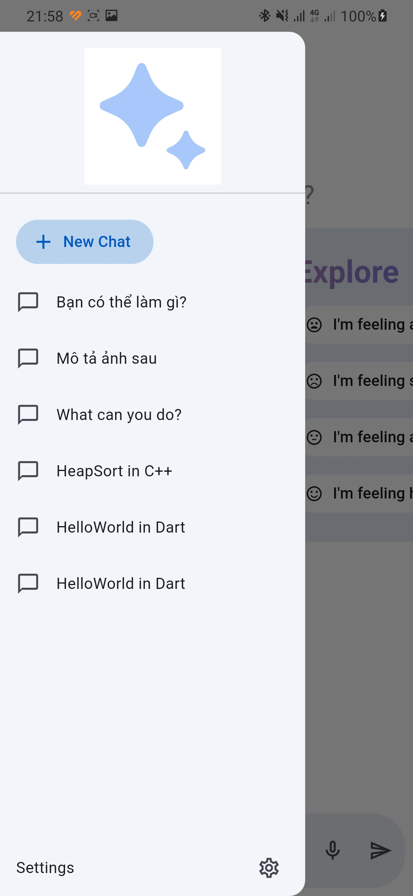
  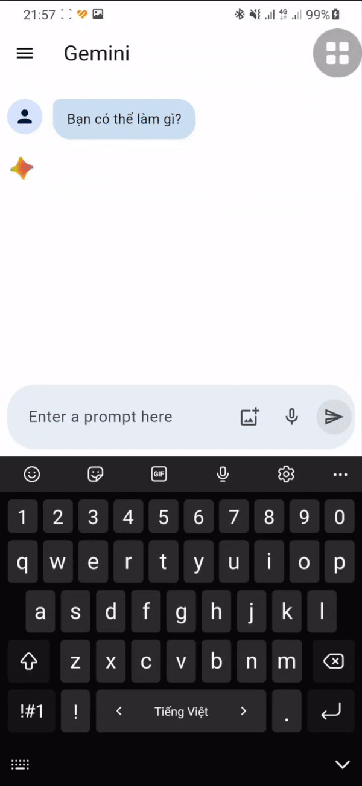

  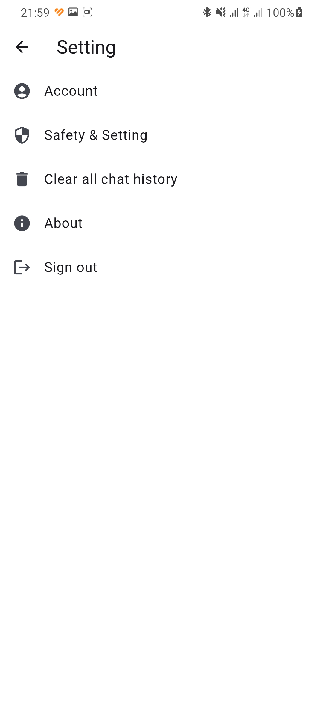
  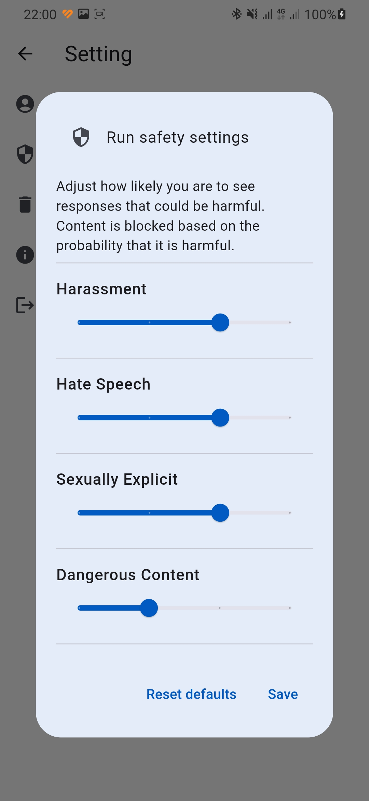

# References
